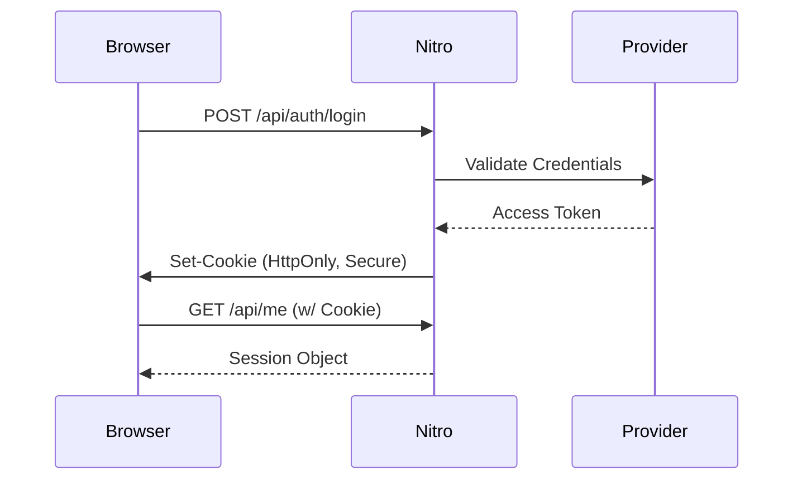

# Authentication Client (H3)

The Auth H3 Client is a lightweight wrapper around session-based authentication, explicitly built for Nitro and H3 to facilitate secure token management and OAuth flows without exposing secrets to the browser.

## Features

- **SSR Ready:** Hydrates session state flawlessly across server and client.
- **Secure by Default:** Tokens are signed and sealed within `HttpOnly` cookies.
- **Provider Agnostic:** Easily plug in OAuth providers like GitHub, Google, or custom enterprise SSO.

## Installation

You don't need to install anything; this module is pre-configured in DocsHub. You can inject it into any API route.

```typescript [server/api/me.get.ts]
export default defineEventHandler(async (event) => {
  const session = await useAuthSession(event)

  if (!session.user) {
    throw createError({ statusCode: 401, statusMessage: 'Unauthorized' })
  }

  return session.user
})
```

### Flow Diagram

Here is a visual representation of how the H3 Client handles a login request from the browser:


