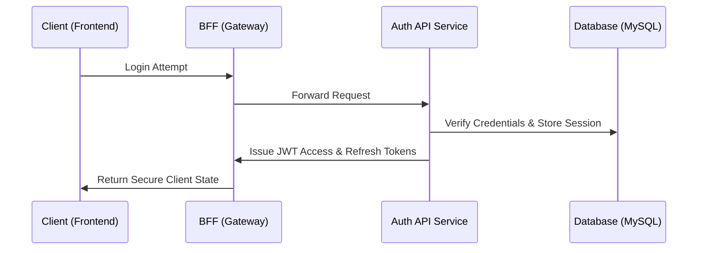

# Identity and Access Management (IAM)

The `@riavzon/jwtauth` library is a robust, enterprise-grade authentication system designed to secure Node.js and Express applications. It handles complex security flows out of the box, allowing you to focus on your application's core logic.

## Architecture & Integration

The library is optimized for a **Centralized Authentication Service** architecture:

Whether imported directly into your monolith as middleware or deployed as a standalone containerized service, `@riavzon/jwtauth` enforces strict security headers, cross-layer integration, and persistent intrusion defense.

### Multi-Layer Security

The IAM module isn't just about verifying passwords. It implements a defense-in-depth strategy before an authentication attempt even hits the database:

1. **Network Security:** Upstream proxy validation and initial rate limits.
2. **Bot Detection Integration:** Paired seamlessly with the Riavzon Bot Detector to block headless browsers and malicious IPs (via Geo-fencing & ASN lookups).
3. **Input Validation:** Strict schema validations (`zod`) preventing injection attacks.

## Core Capabilities

- **Stateful & Stateless Tokens:** Employs stateless short-lived JWTs (HS256/RS256) for horizontal frontend scaling, alongside stateful, rotating, database-backed refresh tokens for strict session revocation.
- **OAuth Integration:** Native, extensible support for managing authentication via third-party OIDC/OAuth providers.
- **Magic Links & Passwordless:** Robust implementation of temporary, cryptographic links for passwordless authentication and account recovery workflows.
- **Multi-Factor Authentication (MFA):** Email-based MFA flows tied to specific visitor fingerprints and "canary cookies" to prevent session hijacking during the 2FA window.
- **Advanced Rate Limiting:** Comprehensive rate-limiting engine backed by dedicated MySQL connection pools. It supports IP-based, email-based, and composite tracking to thwart distributed brute-force attacks via burst/sustained limits.
